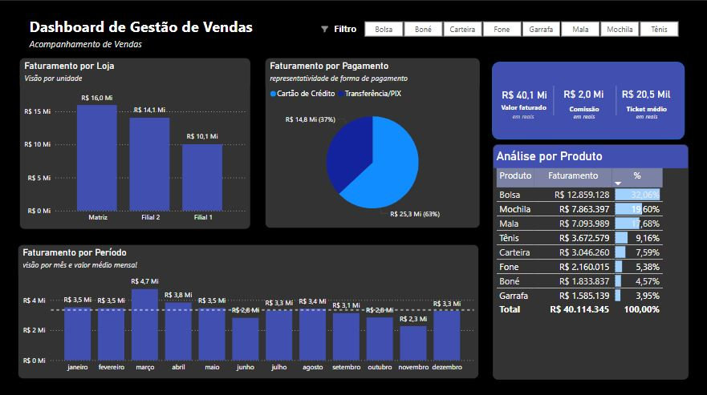

# gestao_de_vendas

# 📊 Dashboard de Gestão de Vendas

Este projeto é um dashboard interativo criado no Power BI com o objetivo de acompanhar o desempenho de vendas por loja, período, forma de pagamento e produtos vendidos.

## 📌 Objetivo

Fornecer uma visão clara e direta sobre os principais indicadores de vendas de uma empresa fictícia, facilitando a tomada de decisão com base em dados reais ou simulados.

## 🛠️ Ferramentas Utilizadas

- Power BI
- Excel (para tratamento dos dados)
- DAX (para medidas e cálculos no Power BI)

## 🔍 Principais Insights

- A **Matriz** foi a loja com maior faturamento (R$ 16,0 Mi).
- A maior parte das vendas foi feita por **Transferência/Pix** (63%).
- O **produto mais vendido** foi a **Bolsa**, com 32,06% do faturamento total.
- O melhor mês em faturamento foi **março**, com R$ 4,7 Mi.

## 📈 Visão do Dashboard

## 🗂️ Como visualizar

Para visualizar o dashboard interativo:

1. Abra o arquivo `.pbix` no Power BI Desktop.
2. Os dados utilizados foram carregados de uma planilha do Excel.
3. Explore os filtros no topo do painel para visualizar as métricas por produto.

---

✅ Projeto desenvolvido para fins de prática e aprimoramento em análise de dados com Power BI.  
